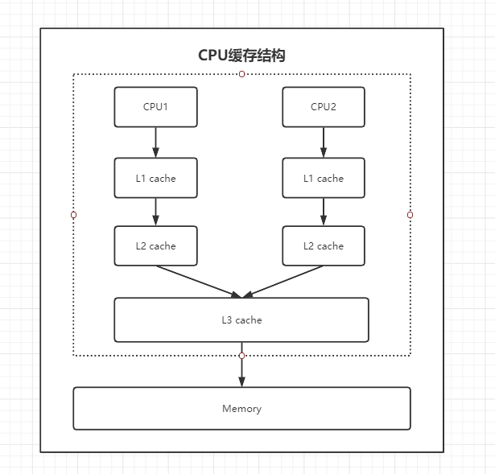
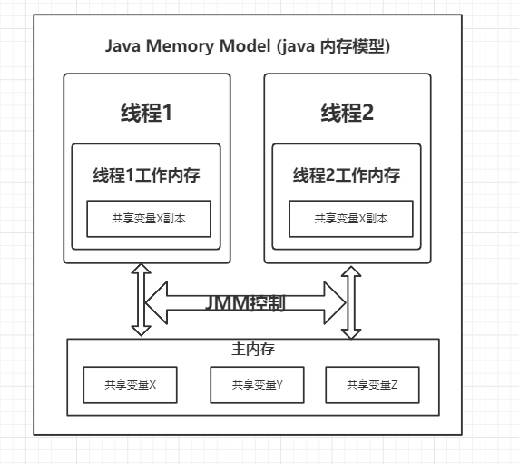
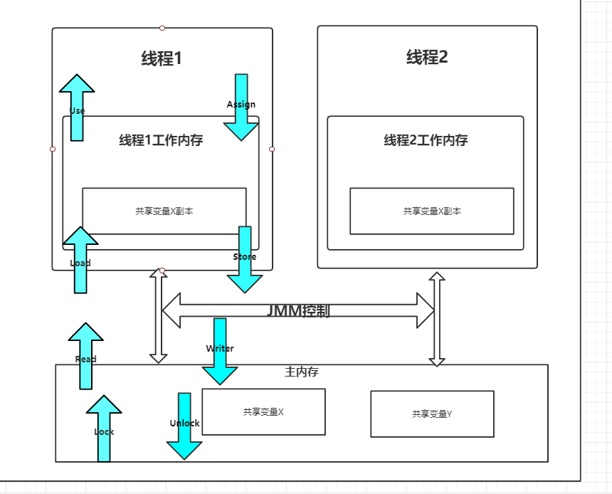

* content
{:toc}
# JMM和volatile关键字

# JMM相关

## CPU缓存模型

> CPU的运算速度和内存的访问速度相差比较大。这就导致CPU每次操作内存都要耗费很多等待时间。内存的读写速度成为了计算机运行的瓶颈。**于是就有了在CPU和主内存之间增加缓存的设计**。最靠近CPU的缓存称为L1，然后依次是 L2，L3和主内存，CPU缓存模型如图下图所示。
>
> - CPU访问数据 -> L1 L2 高速缓存 -> 一致性协议 -> 内存

## Java内存模型（JMM）

- JMM描述的是变量存储到内存和从内存中读取变量的细节。

- Java中实例变量和类变量都是存在于主内存，是线程共享的。

  > - 每个线程都有一个自己的工作内存，它从主内存读取数据到工作内存中进行使用。这样就可能造成了一个线程在主内存中修改了一个变量的值，而另一个线程还在使用之前拷贝的值，就造成了数据的不一致型。
  > - 解决：把变量声明为volatile，指示这个变量是不稳定的，没用使用的时候需要从主内存中读取。

> - 主内存 所有线程共享的内存区域 线程内存 线程自己私有的内存区域 主内存和线程内存通过save和load操作进行交互 所有提到的内存区域并不是真实存在的，而是虚拟存在的，就和虚拟机的运行时数据区一样。

## JMM 的八种内存交互操作

1. lock(锁定)：作用于**主内存**中的变量，一个变量在同一时间只能被一个线程锁定，即把变量标识为线程**独占**状态。
2. read(读取)：作用于**主内存**变量，表示把一个变量值从主内存传输到线程的工作内存中，以便下一步的 load 操作使用。
3. load(载入)：作用于线程的**工作内存**的变量，表示把 read 操作从主内存中读取的变量值放到工作内存的变量副本中(副本是相对于主内存的变量而言的)。
4. use(使用)：作用于线程的**工作内存**中的变量，表示把工作内存中的一个变量值传递给执行引擎，每当虚拟机遇到一个需要使用变量的值的字节码指令时就会执行该操作。
5. assign(赋值)：作用于线程的**工作内存**的变量，表示把执行引擎返回的值赋值给工作内存中的变量，每当虚拟机遇到一个给变量赋值的字节码指令时就会执行该操作。
6. store(存储)：作用于线程的**工作内存**中的变量，把工作内存中的一个变量的值传递给主内存，以便下一步的 write 操作使用。
7. write(写入)：作用于**主内存**的变量，表示把 store 操作从工作内存中得到的变量的值放入主内存的变量中。
8. unlock(解锁)：作用于**主内存**的变量，表示把一个处于锁定状态的变量释放出来，释放后的变量才可以被其他线程锁定。

JMM 还规定了以上八种操作需按照如下规则进行：

- 不允许read 和 load、store 和 write 操作之一单独出现，也就是 read 操作后必须 load，store 操作后必须 write。即不允许一个变量从主内存读取了但工作内存不接受，或者从工作内存发起回写了但主内存不接受的情况出现。
- 不允许线程丢弃它最近的 assign 操作，即变量在工作内存中改变了之后必须把该变化同步回主内存。
- 不允许线程将没有 assign 的数据从工作内存同步到主内存。
- 一个新的变量必须在主内存中诞生，不允许工作内存直接使用一个未被初始化的变量。也就是对变量实施 use 和 store 操作之前，必须经过 load 和 assign 操作。
- 一个变量同一时间只能有一个线程对其进行 lock 操作。但 lock 操作可以被同一条线程重复执行多次，多次 lock 之后，必须执行相同次数 unlock 才可以解锁。
- 如果对一个变量进行 lock 操作，会清空所有工作内存中此变量的值。在执行引擎使用这个变量前，必须重新 load 或 assign 操作初始化变量的值。
- 如果一个变量没有被 lock，就不能对其进行 unlock 操作。也不能 unlock 一个被其他线程锁住的变量。
- 一个线程对一个变量进行 unlock 操作之前，必须先把此变量同步回主内存。

## JMM 三大特征

> JMM 三大特征分别是：原子性，可见性，有序性。整个 JMM 实际上也是围绕着这三个特征建立起来的，并且也是 Java 并发编程的基础。

**原子性**：原子性是指一个操作是不可分割、不可中断的，要么全部执行成功要么全部执行失败。

- synchronized 修饰的代码块之间的操作都是原子性的，**volatile不保证原子性**

**可见性**：可见性是指所有线程都能看到共享内存的最新状态。即当一个线程修改了一个共享变量的值时，其他线程能够立即看到该变量的最新值。

- volatile 关键字之外，final 和 synchronized 也能实现可见性。

**有序性**：有序性是指程序执行的顺序按照代码的先后顺序执行。

- 可以通过 volatile 和 synchronized 关键字来保证多线程之间操作的有序性。

  - volatile 关键字是通过在主存中加入内存屏障来达到禁止指令重排序，来保证有序性。

  - synchronized 关键字原理是，一个变量在同一时刻只能被一个线程 lock，并且必须 unlock 后，其他线程才可以重新 lock，使得被 synchronized 修饰的代码块在多线程之间是串行执行的。

# Volatile

## volatile关键字

- volatitle可以保证变量的可见性。

## volatile禁止指令重排序

- volatile写是在前⾯和后⾯分别插⼊**内存屏障**，⽽volatile读操作是在后⾯插⼊两个内存屏障。

## CAS算法 

> compare-and-swap--比较并替换

- CAS 有三个操作数，内存里当前值M，预期值 E，修改的新值 N，CAS 的语义就是：如果当前值等于预期值，则将内存修改为新值，否则不做任何操作。
- Java中Unsafe类
- 每次在执行CAS操作时，线程会根据valueOffset去内存中获取当前值去跟expect的值做对比如果一致则修改并返回true，如果不一致说明有别的线程也在修改此对象的值，则返回false

## ABA问题

- 一个线程对变量进行了修改，然后又修改会原来的值，对于其他线程来说好像没有变化。
- 解决ABA最简单的方案就是给值加一个修改版本号，每次值变化，都会修改它版本号，CAS操作时都对比此版本号

## synchronized和volatile的区别

- volatile是线程同步的轻量级实现，只能修饰变量；而synchronized可以修饰方法及代码块
- volatile关键字能够保证数据的可见性，不能保证数据的原子性；synchronized两者都可以保证
- volatile解决的是多个线程访问变量的可见性；synchronized解决的是多线程之间访问资源的同步性