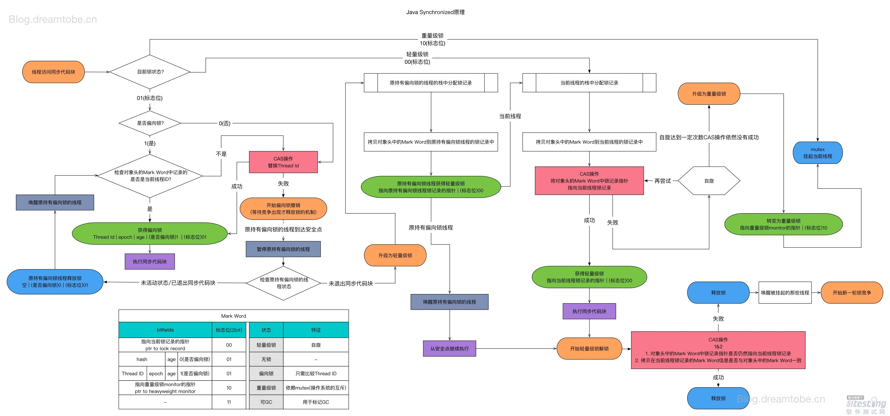

* content
{:toc}
# Synchronized关键字 #

## 概念

- synchronized 是为了解决多线程同步访问资源的问题。 synchronized 关键字可以保证被它修饰的方法或者代码块在任意时刻只能有一个线程执行。
- Java多线程依赖于操作系统原生线程，所以挂起或者唤醒一个线程，需要操作系统帮忙完成。而操作系统需要从用户状态切换成内核状态，时间相对较长，时间成本高。

## 使用

- 修改实例方法和代码块：作用于给当前对象加锁

- 修饰静态方法和代码块：作用于给当前类加锁

  

  > - 在 java 中，每一个对象有且仅有一个同步锁。这也意味着：同步锁是依赖于对象存在的。
  >
  > - 当我们调用某对象的 synchronized 方法时，就获取了该对象的同步锁。（例如：synchronized(ObjA) 就获取了 "ObjA这个对象" 的同步锁）
  > - 不同线程对同步锁的访问是互斥的。（也就是说：某个时间点，对象的同步锁只能被一个线程获取到，通过同步锁，能实现多线程间 "对象/方法" 的互斥访问）

## synchronized底层原理

**synchronized 关键字底层原理是JVM层面的**

- synchronized 同步语句块的情况
  1. synchronized 同步语句块的实现使用的是 monitorenter 和 monitoreexit 指令， 期中 monitorenter 指令指向同步代码块的开始位置， monitorexit 指令则指向同步代码块的结束位置
  2. 当执行 monitorenter 指令时，线程试图获取锁也就是获取 monitor 对象的特有权。当计数器为 0 则可以成功获取，获取后将锁计数器设为 1 就就是 加1 。相对应的在执行 monitorexit 指令后， 所得计数器就会 -1，当锁计数器变为0，标明锁被释放。
  3. 如果获取对象的锁失败，那么当前线程就要阻塞等待，直到锁被另外一个线程释放为止。
  4. （monitor 对象存在于每个 java 对象的对象头中 ，synchronized 锁便是通过这种方式获取锁的，也是为什么java中任意对象可以作为锁的原因）

- synchronized 修饰方法的情况
  1. JVM 通过 ACC_SYNCHRONIZED 访问标志来辨别一个方法是否声明为同步方法，从而执行相应的同步调用。
  2. 用的是一个隐式的 monitorenter 和 monitorexit 指令。

## synchronized 锁优化的过程（锁升级）

- 锁的状态有：无锁状态、偏向锁状态、轻量级锁状态、重量级锁状态，随着锁竞争的激烈而逐渐升级。锁只可以升级不可以降级，这种策略是为了提高获取锁和释放锁的效率。

### 偏向锁

> 单个线程重复访问资源的时候没有必要向操作系统重新申请轻量级锁。

- 过程：
  
- 一个线程加锁的时候会在对象头添加标识（线程id）,以后这个线程进入或者退出代码块的时候不需要 CAS 的操作来加锁和解锁，只需要判断一个对象头（Mark Word）是否存储了执行当前线程的偏向锁。如果测试成功，表明当前线程已经获得了锁。如果失败，判断锁的标志位是否为1，为1，使用CAS竞争锁。不为1，就尝试将对象头的偏向锁指向当前线程。
  
- 偏向锁的撤销
  
  - 偏向锁适用于任何时间段的操作，在其他线程进行 CAS 尝试修改对象头的线程 id 时，能正好完成锁的释放。如果不能释放锁，那么就需要进行锁竞争。
  
  - 如果被撤销的次数超过 40 次 （epoch），说明该资源不适合偏向锁，就需要升级为轻量级锁。

### 轻量级锁

> 多个线程重复访问资源的时候，可以使用指针竞争的方式来获取轻量级锁

- 过程
  - 线程将对象头中标记字段复制到自身的锁空间中，然后尝试用 CAS 的操作将对象头的标记字段替换为锁的指针。替换成功就表明获取了轻量级锁，失败就尝试进入自旋状态获取锁。

### 自旋锁

- 如果没有在第一时间获取到轻量级锁，可能需要等一会儿就可以获取锁。这时使用 CAS 的操作不断自旋该线程。默认限定 10 次，没有获取锁，就用传统方式挂起线程。
- 在自旋的基础上， Java1.6 引入了适应性自旋锁。它的等待时间不是固定的，而是由前一次操作的时间以及锁拥有的状态来决定。

### 锁的使用场景

- 偏向锁：通常只有一个线程访问临界区
- 轻量级锁：可以有多个线程交替进入临界区，竞争不激烈的时候，稍微自旋就能获得锁
- 重量级锁：线程间出现激烈的竞争就需要重量级锁，未获得锁的线程就会进入阻塞队列，需要操作系统介入。

| 锁       | 优点                                                         | 缺点                                           | 适用场景                           |
| -------- | ------------------------------------------------------------ | ---------------------------------------------- | ---------------------------------- |
| 偏向锁   | 加锁和解锁不需要额外的开销，和执行非同步方法比仅存在纳秒级的差距 | 如果线程间存在锁竞争，会带来额外的锁撤销的消耗 | 适用于只有一个线程访问同步块的场景 |
| 轻量级锁 | 竞争线程不会阻塞，提高了程序的响应速度                       | 如果始终得不到锁竞争的线程使用自旋会消耗CPU    | 追求响应时间。同步块执行速度非常快 |
| 重量级锁 | 锁竞争不适用自旋，不会消耗CPU                                | 线程阻塞，响应时间缓慢                         | 追求吞吐量。同步块执行速度较长。   |

