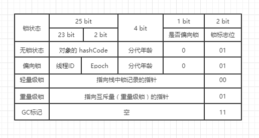
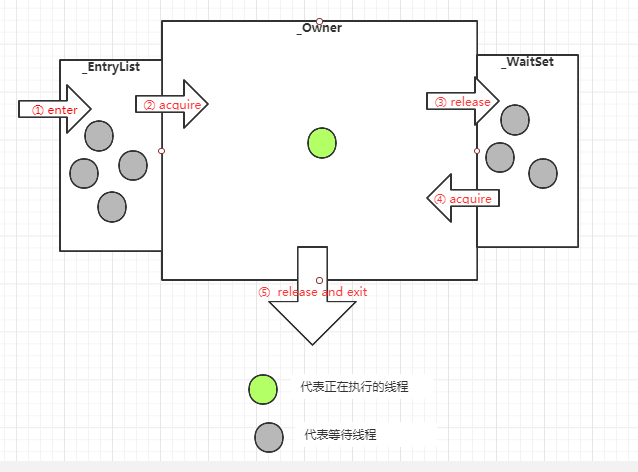

* content
{:toc}
# Synchronized关键字 #

## 概念

- synchronized 是为了解决多线程同步访问资源的问题。 synchronized 关键字可以保证被它修饰的方法或者代码块在任意时刻只能有一个线程执行。
- Java多线程依赖于操作系统原生线程，所以挂起或者唤醒一个线程，需要操作系统帮忙完成。而操作系统需要从用户状态切换成内核状态，时间相对较长，时间成本高。

## 使用

- 修改实例方法：作用于当前实例加锁，进入同步代码前要获得当前实例的锁。

  > 多个线程操作同一个实例的加锁方法时，线程安全

- 修饰静态方法：作用于当前类对象(Class对象，每个类都有一个Class对象)，进入同步代码前要获得当前类对象（Class对象）的锁。

  > 多个线程操作同一个Class的多个实例时，线程安全。（如果是非静态方法加的synchronized那么则是不安全的，因为不是同一把锁）

- 修饰代码块：指定加锁对象，对给定对象加锁，进入同步代码库前要获得给定对象的锁。

  > - synchronized(this){}，当前实例对象锁
>
  > - synchronized(ObjA.class){}，class对象锁


> - 在 java 中，每一个对象有且仅有一个同步锁。这也意味着：同步锁是依赖于对象存在的。
>- 当我们调用某对象的 synchronized 方法时，就获取了该对象的同步锁。（例如：synchronized(ObjA) 就获取了 "ObjA这个对象" 的同步锁）
> - 不同线程对同步锁的访问是互斥的。（也就是说：某个时间点，对象的同步锁只能被一个线程获取到，通过同步锁，能实现多线程间 "对象/方法" 的互斥访问）

## synchronized底层原理

## java对象头

HotSpot 虚拟机中，对象在内存中存储的布局可以分为三块区域：**对象头**（Header），**实例数据**（Instance Data）和**对齐填充**

- 普通对象的对象头包含两个部分：**Mark Word** 和 **Class Metadata Address** （类型指针）
- 如果是数组的对象头还额外包括 **Array length** 数组长度部分

### Mark word：

- 用于存储对象自身的运行时数据，如 哈希码（HashCode）、GC分代年龄、锁状态标志、线程持有的锁、偏向线程ID、偏向时间戳等等，占用内存大小与虚拟机位长一致。

### Class Metadata Address：类型指针

- 类型指针指向对象的类元数据，虚拟机通过这个指针确定该对象是哪一个类的实例

### Array length：数组长度

- 如果对象是数组类型。则虚拟机用3个 Word （字宽）存储对象头，如果对象是非数组类型，则用 2 字节宽存储对象头。在 32 位虚拟机中，一字节宽等于 4 字节，及 32bit。

| 长度     | 内容                   | 说明                                   |
| -------- | ---------------------- | -------------------------------------- |
| 32/64bit | Mark Word              | 存储对象hashCode或锁信息等运行时数据。 |
| 32/64bit | Class Metadata Address | 存储到对象类型数据的指针               |
| 32/64bit | Array length           | 数组的长度（如果当前对象是数组）       |

#### Mark Word详解

对象需要存储的运行时数据很多，其实已经超出了32、64位Bitmap结构所能记录的限度，但是对象头信息是与对象自身定义的数据无关的额外存储成本，考虑到虚拟机的空间效率，Mark Word被设计成一个非固定的数据结构以便在极小的空间内存储尽量多的信息，它会根据对象的状态复用自己的存储空间。

> 例如在32位的HotSpot虚拟机 中对象未被锁定的状态下，MarkWord的32个Bits空间中的25Bits用于存储对象哈希码（HashCode），4Bits用于存储对象分代年龄，2Bits用于存储锁标志位，1Bit固定为0，
>
> 在其他状态（轻量级锁定、重量级锁定、GC标记、可偏向）下对象的存储内容如下表所示。



#### Monitor对象

- 什么是Monitor？我们可以把它理解为一个同步工具，也可以描述为一种同步机制，它通常被描述为一个对象。与一切皆对象一样，所有的Java对象是天生的Monitor，每一个Java对象都有成为Monitor的潜质，因为在Java的设计中，每一个Java对象自打娘胎里出来就带了一把看不见的锁，它叫做**内部锁**或者**Monitor锁**。

- 每个对象都存在着一个 monitor 与之关联，对象与其 monitor 之间的关系又存在多种实现方式，如monitor可以与对象一起创建销毁或当线程试图获取对象锁时自动生成，但当一个 monitor 被某个线程持有后，它便处于锁定状态。在Java虚拟机(HotSpot)中，monitor是由ObjectMonitor实现的，其主要数据结构如下（位于HotSpot虚拟机源码ObjectMonitor.hpp文件，C++实现的）。

```c
ObjectMonitor() {
   _header       = NULL;
   _count        = 0; //记录个数
   _waiters      = 0,
   _recursions   = 0;
   _object       = NULL;
   _owner        = NULL;
   _WaitSet      = NULL; //处于wait状态的线程，会被加入到_WaitSet
   _WaitSetLock  = 0 ;
   _Responsible  = NULL ;
   _succ         = NULL ;
   _cxq          = NULL ;
   FreeNext      = NULL ;
   _EntryList    = NULL ; //处于等待锁block状态的线程，会被加入到该列表
   _SpinFreq     = 0 ;
   _SpinClock    = 0 ;
   OwnerIsThread = 0 ;
 }
```

ObjectMonitor中有两个队列，_WaitSet和_EntryList，用来保存ObjectWaiter对象列表(每个等待锁的线程都会被封装成ObjectWaiter对象)，_owner指向持有ObjectMonitor对象的线程，当多个线程同时访问一段同步代码时，首先会进入 _EntryList 集合，当线程获取到对象的monitor 后进入 _Owner 区域并把monitor中的owner变量设置为当前线程同时monitor中的计数器count加1，若线程调用wait()方法，将释放当前持有的monitor，owner变量恢复为null，count自减1，同时该线程进入WaitSet集合中等待被唤醒。若当前线程执行完毕也将释放monitor(锁)并复位变量的值，以便其他线程进入获取monitor(锁)。如下图所示



## synchronized 关键字底层原理是JVM层面的**

### synchronized 同步语句块的情况

1. synchronized 同步语句块的实现使用的是 **monitorenter** 和 **monitoreexit** 指令， 其中 monitorenter 指令指向同步代码块的开始位置， monitorexit 指令则指向同步代码块的结束位置
2. 当执行 monitorenter 指令时，线程试图获取锁也就是获取 monitor 对象的特有权。**当计数器为 0 则可以成功获取monitor**，获取后将锁计数器设为 1 就是 加1 （**重入时计数器的值也会加 1**）， 。相对应的在执行 monitorexit 指令后， 所得计数器就会 -1，当锁计数器变为0，标明锁被释放。
3. 如果获取对象的锁失败，那么当前线程就要阻塞等待，直到锁被另外一个线程释放为止。
4. （monitor 对象存在于每个 java 对象的对象头中 ，synchronized 锁便是通过这种方式获取锁的，也是为什么java中任意对象可以作为锁的原因）

### synchronized 修饰方法的情况

1. JVM 通过 ACC_SYNCHRONIZED 访问标志来辨别一个方法是否声明为同步方法，从而执行相应的同步调用。

2. 用的是一个隐式的 monitorenter 和 monitorexit 指令。

   > 1. 方法级的同步是隐式，即无需通过字节码指令来控制的，它实现在方法调用和返回操作之中。
   > 2. JVM可以从方法常量池中的方法表结构(method_info Structure) 中的 ACC_SYNCHRONIZED 访问标志区分一个方法是否同步方法。
   > 3. 当方法调用时，调用指令将会 检查方法的 ACC_SYNCHRONIZED访问标志是否被设置，如果设置了，执行线程将先持有monitor（虚拟机规范中用的是管程一词），然后再执行方法，最后再方法完成(无论是正常完成还是非正常完成)时释放monitor。
   > 4. 在方法执行期间，执行线程持有了monitor，其他任何线程都无法再获得同一个monitor。如果一个同步方法执行期间抛出了异常，并且在方法内部无法处理此异常，那这个同步方法所持有的monitor将在异常抛到同步方法之外时自动释放。

## synchronized 锁优化的过程（锁升级）

- 锁的状态有：无锁状态、偏向锁状态、轻量级锁状态、重量级锁状态，随着锁竞争的激烈而逐渐升级。锁只可以升级不可以降级，这种策略是为了提高获取锁和释放锁的效率。

> Synchronized的实现依赖于与某个对象向关联的monitor（监视器）实现，而monitor是基于底层操作系统的Mutex Lock实现的，而基于Mutex Lock实现的同步必须经历从用户态到核心态的转换，这个开销特别大，成本非常高。所以频繁的通过Synchronized实现同步会严重影响到程序效率，而这种依赖于Mutex Lock实现的锁机制也被称为“重量级锁”，为了减少重量级锁带来的性能开销，JDK对Synchronized进行了种种优化。

### 偏向锁

- 单个线程重复访问资源的时候没有必要向操作系统重新申请轻量级锁。

#### ***获取锁***：

1. 检测Mark Word是否为可偏向状态，即是否为偏向锁1，锁标识位为01；
2. 若为可偏向状态，则测试线程ID是否为当前线程ID，如果是，则执行步骤（5），否则执行步骤（3）；
3. 如果线程ID不为当前线程ID，则通过CAS操作竞争锁，竞争成功，则将Mark Word的线程ID替换为当前线程ID，否则执行线程（4）；
4. 通过CAS竞争锁失败，证明当前存在多线程竞争情况，当到达全局安全点，获得偏向锁的线程被挂起，偏向锁升级为轻量级锁，然后被阻塞在安全点的线程继续往下执行同步代码块；
5. 执行同步代码块

#### ***释放锁***： 

**偏向锁的释放采用了一种只有竞争才会释放锁的机制**，线程是不会主动去释放偏向锁，需要等待其他线程来竞争。偏向锁的撤销需要等待全局安全点（这个时间点是上没有正在执行的代码）。其步骤如下：

1. 暂停拥有偏向锁的线程，判断锁对象石是否还处于被锁定状态；
2. 撤销偏向苏，恢复到无锁状态（01）或者轻量级锁的状态；

> 在有锁状态时，位置被锁指针占用，那hashCode等信息要存到哪里?
>
> 下面先看偏向锁的情况，偏向锁时，mark word中记录了线程id，没有足够的额外空间存储hashcode，所以，答案是：
>
> 1. 当一个对象已经计算过identity hash code，它就无法进入偏向锁状态；
> 2. 当一个对象当前正处于偏向锁状态，并且需要计算其identity hash code的话，则它的偏向锁会被撤销，并且锁会膨胀为重量锁；
> 3. 重量锁的实现中，ObjectMonitor类里有字段可以记录非加锁状态下的mark word，其中可以存储identity hash code的值。或者简单说就是重量锁可以存下identity hash code。
>
> 因为mark word里没地方同时放bias信息和identity hash code。 HotSpot VM是假定“实际上只有很少对象会计算identity hash code”来做优化的；换句话说如果实际上有很多对象都计算了identity hash code的话，HotSpot VM会被迫使用比较不优化的模式。

### 轻量级锁

- 多个线程重复访问资源的时候，可以使用指针竞争的方式来获取轻量级锁

#### ***获取锁***：

1. 判断当前对象是否处于无锁状态（hashcode、0、01），若是，则JVM首先将在当前线程的栈帧中建立一个名为锁记录（Lock Record）的空间，用于存储锁对象目前的Mark Word的拷贝（官方把这份拷贝加了一个Displaced前缀，即Displaced Mark Word）；否则执行步骤（3）；
2. JVM利用CAS操作尝试将对象的Mark Word更新为指向Lock Record的指正，如果成功表示竞争到锁，则将锁标志位变成00（表示此对象处于轻量级锁状态），执行同步操作；如果失败则执行步骤（3）；
3. 判断当前对象的Mark Word是否指向当前线程的栈帧，如果是则表示当前线程已经持有当前对象的锁，则直接执行同步代码块；否则只能说明该锁对象已经被其他线程抢占了，这时轻量级锁需要膨胀为重量级锁，锁标志位变成10，后面等待的线程将会进入阻塞状态；

#### ***释放锁***： 

	> 轻量级锁的释放也是通过CAS操作来进行的，主要步骤如下：

1. 取出在获取轻量级锁保存在Displaced Mark Word中的数据；
2. 用CAS操作将取出的数据替换当前对象的Mark Word中，如果成功，则说明释放锁成功，否则执行（3）；
3. 如果CAS操作替换失败，说明有其他线程尝试获取该锁，则需要在释放锁的同时需要唤醒被挂起的线程。

轻量级锁状态时，位置被锁指针占用，那hashCode等信息要存到哪里？这里的问题就比较简单了，因为有拷贝的mark word，所以Displaced Mark Word中存在所需要的信息。

> 轻量级锁状态时，位置被锁指针占用，那hashCode等信息要存到哪里？这里的问题就比较简单了，因为有拷贝的mark word，所以Displaced Mark Word中存在所需要的信息。

### 重量级锁

- 重量级锁通过对象内部的监视器（monitor）实现，其中monitor的本质是依赖于底层操作系统的Mutex Lock实现，操作系统实现线程之间的切换需要从用户态到内核态的切换，切换成本非常高。

### 自旋锁

- 如果没有在第一时间获取到轻量级锁，可能需要等一会儿就可以获取锁。这时使用 CAS 的操作不断自旋该线程。默认限定 10 次，没有获取锁，就用传统方式挂起线程。
- 在自旋的基础上， Java1.6 引入了适应性自旋锁。它的等待时间不是固定的，而是由前一次操作的时间以及锁拥有的状态来决定。

### 适应自旋锁

- JDK 1.6引入了更加聪明的自旋锁，即自适应自旋锁。所谓自适应就意味着自旋的次数不再是固定的，它是由前一次在同一个锁上的自旋时间及锁的拥有者的状态来决定。它怎么做呢？线程如果自旋成功了，那么下次自旋的次数会更加多，因为虚拟机认为既然上次成功了，那么此次自旋也很有可能会再次成功，那么它就会允许自旋等待持续的次数更多。反之，如果对于某个锁，很少有自旋能够成功的，那么在以后要或者这个锁的时候自旋的次数会减少甚至省略掉自旋过程，以免浪费处理器资源。

- 有了自适应自旋锁，随着程序运行和性能监控信息的不断完善，虚拟机对程序锁的状况预测会越来越准确，虚拟机会变得越来越聪明。

### 锁消除

- 为了保证数据的完整性，我们在进行操作时需要对这部分操作进行同步控制，但是在有些情况下，JVM检测到不可能存在共享数据竞争，这是JVM会对这些同步锁进行锁消除。锁消除的依据是逃逸分析的数据支持。 如果不存在竞争，为什么还需要加锁呢？所以锁消除可以节省毫无意义的请求锁的时间。变量是否逃逸，对于虚拟机来说需要使用数据流分析来确定，但是对于我们程序员来说这还不清楚么？我们会在明明知道不存在数据竞争的代码块前加上同步吗？但是有时候程序并不是我们所想的那样？我们虽然没有显示使用锁，但是我们在使用一些JDK的内置API时，如StringBuffer、Vector、HashTable等，这个时候会存在隐形的加锁操作。比如StringBuffer的append()方法，Vector的add()方法。

### 锁的使用场景

- 偏向锁：通常只有一个线程访问临界区
- 轻量级锁：可以有多个线程交替进入临界区，竞争不激烈的时候，稍微自旋就能获得锁
- 重量级锁：线程间出现激烈的竞争就需要重量级锁，未获得锁的线程就会进入阻塞队列，需要操作系统介入。

| 锁       | 优点                                                         | 缺点                                           | 适用场景                           |
| -------- | ------------------------------------------------------------ | ---------------------------------------------- | ---------------------------------- |
| 偏向锁   | 加锁和解锁不需要额外的开销，和执行非同步方法比仅存在纳秒级的差距 | 如果线程间存在锁竞争，会带来额外的锁撤销的消耗 | 适用于只有一个线程访问同步块的场景 |
| 轻量级锁 | 竞争线程不会阻塞，提高了程序的响应速度                       | 如果始终得不到锁竞争的线程使用自旋会消耗CPU    | 追求响应时间。同步块执行速度非常快 |
| 重量级锁 | 锁竞争不适用自旋，不会消耗CPU                                | 线程阻塞，响应时间缓慢                         | 追求吞吐量。同步块执行速度较长。   |

### 锁的膨胀流程

