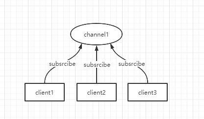
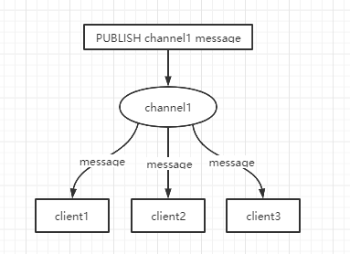
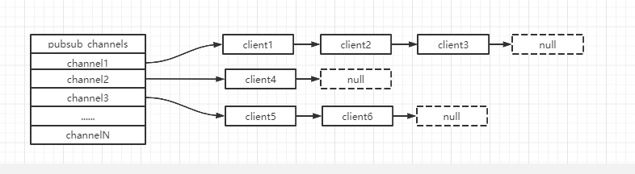

* content
{:toc}

# Redis发布订阅模式

## 概念

Redis发布订阅（pub/sub）是一种消息通信模式：发布者（pub）,发送消息，订阅者（sub）接收消息。

- 下图展示了频道 channel1，以及订阅这个频道的三个客户端--client1、client2和client3之间的关系：

- 当有新的消息通过PUBLISH命令发送给频道 channel1 时，这个消息就会被发送给订阅他的三个客户端：

## 命令

| 命令                                     | 描述                               |
| ---------------------------------------- | ---------------------------------- |
| `PSUBSCRIBE pattern [pattern..]`         | 订阅一个或多个符合给定模式的频道。 |
| `PUNSUBSCRIBE pattern [pattern..]`       | 退订一个或多个符合给定模式的频道。 |
| `PUBSUB subcommand [argument[argument]]` | 查看订阅与发布系统状态。           |
| `PUBLISH channel message`                | 向指定频道发布消息                 |
| `SUBSCRIBE channel [channel..]`          | 订阅给定的一个或多个频道。         |
| `SUBSCRIBE channel [channel..]`          | 退订一个或多个频道                 |

## 示例

// TODO

## 原理

每个 redis 服务器进程都维持着一个表示服务器状态的 redis.h/redisServer结构，结构的 pubsub_channels 属性是一个字典，这个字典就用于保存订阅频道的信息，其中，字典的键为正在被订阅的频道，而字典的值则是一个链表，链表中保存了所有订阅这个频道的客户端。

## 缺点

1. 如果一个客户端订阅了频道，但自己读取消息的速度确不够快的话，那么不断积压消息会使 redis 输出缓冲区的体积变得越来越大，这可能使得 redis 本身的速度变慢，甚至直接崩溃。
2. 这和数据传输可靠性有关，如果在订阅方断线，那么他将会丢失所有在短期时间发布者发布的消息。

## 应用

1. 消息订阅：公众号订阅，微博关注等等（其实更多的是消息队列来进行实现）
2. 多人在线聊天室

稍微复杂的场景，我们就会使用消息中间件MQ来处理。

