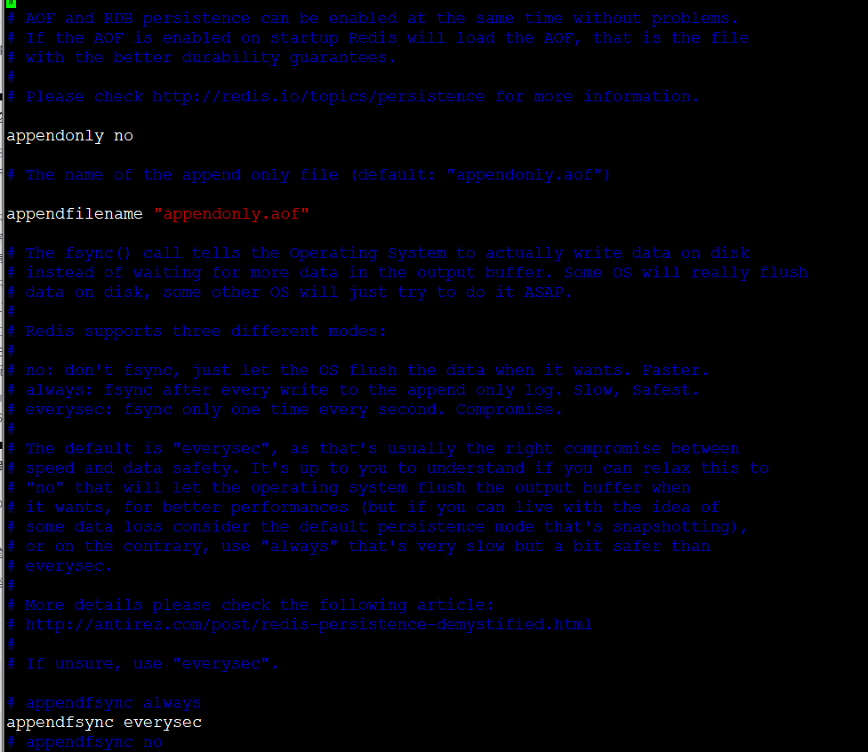

* content
{:toc}
# 持久化

## 一、持久化—— RDB

### 什么是RDB

- 在指定时间间隔后，将内存中的数据快照写入硬盘，在恢复的时候，直接读取快照文件，进行数据的恢复。

- 默认情况下，redis将数据库快照保证在名字为 dump.rdb 的二进制文件中。文件名可以在配置文件中进行自定义。

### 工作原理：

在进行rdb的时候，redis主线程是不会做io操作的，主线程会 fork 一个子线程来完成该操作：

1. Redis 调用 fork 。 同时拥有父进程和子进程。
2. 子进程将数据集写入到一个临时 RDB 文件中
3. 当子进程完成对新 RDB 文件写入时， Redis 用新 RDB 文件替换原来的 RDB 文件，并删除旧的 RDB 文件

这种工作方式使得Redis 可以从写时复制（copy-on-write） 机制中获益（因为是使用子进程进行写操作，而父进程依然可以接收来自客户端的请求）

### 触发机制

1. save 的规则满足的情况下， 会自动触发 rdb原则
2. 执行 flushall 命令也会触发我们的 rdb 原则
3. 退出 redis 也会自动产生 rdb 文件

#### save

使用 save 命令， 会立刻对当前内存中的数据进行持久化， 但是会阻塞， 也就是不接受其他操作了

> 由于 save 命令是同步命令， 会占用 Redis 的主进程。 若Redis 数据非常多时， save 命令执行速度会非常慢，阻塞所有客户端的请求。

#### flushall

flushall 命令也会触发持久化

#### 触发持久化规则

满足配置条件中的触发条件：

> 可以通过配置文件对 Redis 进行设置， 让它在 “N 秒内数据集至少有 M 个改动” 这一条件满足时， 会自动进行数据集保存操作。

#### bgsave

bgsave 是异步进行， 进行持久化的时候， redis 还可以将继续响应客户端请求

bgsave 和 save 对比

| 命令   | save               | bgsave                             |
| ------ | ------------------ | ---------------------------------- |
| IO类型 | 同步               | 异步                               |
| 阻塞？ | 是                 | 是（阻塞发生在fock()，通常非常快） |
| 复杂度 | O(n)               | O(n)                               |
| 优点   | 不会消耗额外的内存 | 不阻塞客户端命令                   |
| 缺点   | 阻塞客户端命令     | 需要fock子进程，消耗内存           |

### 优缺点

优点：

1. 适合大规模的数据恢复
2. 对数据的完整性要求不高

缺点：

1. 需要一定的时间间隔进行操作，如果redis意外宕机了，这个最后一次修改的数据就没有了
2. fork 进程的时候， 会占用一定的内存空间

## 二、持久化—— AOF

Append Only File

将我们所有的命令都记录下来， history 恢复的时候就把这个文件全部再执行一遍

> 以日志的形式来记录每个写操作，将redis执行的指令记录下来（读操作不记录），只需追加文件但不可以修改文件，redis 启动之初会读取改文件重新构建数据，换言之，redis重启的话就根据日志文件的内容将写指令从前到后执行一次以完成数据的恢复工作。

### 什么是AOF

快照功能（RDB) 并不是非常耐久：如果redis因为某些原因而造成故障停机，那么服务器将丢失最近写入，以及未保存到快照中的那些数据，从1.1版本开始，Redis增加了一种完全耐久的持久方式：AOF持久化。

如果要使用AOF，需要修改配置文件：

>  appendonly  yes 则表示启动AOF
>
> appendfilename "appendonly.aof"  表示保存的文件名为 "appendonly.aof"
>
> appendfsync  everysec  每秒同步一次

appendonly 默认是no  不开启的，我们需要手动配置，然后重启redis，就可以生效

如果这个aof文件有错误，这时候 redis 是启动不起来的，我们需要修改这个aof文件

redis给我们提供了一个工具， redis-check-aof --fix

#### 优缺点

优点：

- 每一次修改都会同步，文件的完整性会更加的好
- 每秒同步一次，可能会丢失最后一秒的数据
- 从不同步，效率最高

缺点

- 相对于数据文件来说，aof远远大于rdb，修复速度比 rdb 慢！
- aof 运行效率也比 rdb 慢，所以我们 redis 默认的配置就是 rdb 持久化

RDB与AOF的选择

|            | RDB    | AOF          |
| ---------- | ------ | ------------ |
| 启动优先级 | 低     | 高           |
| 体积       | 小     | 大           |
| 恢复速度   | 快     | 慢           |
| 数据安全性 | 丢数据 | 根据策略决定 |

如何选择使用哪种持久化方式？

- 一般来说，如果想达到足以媲美 PostgreSQL 的数据安全性， 你应该同时使用两种持久化功能。

- 如果你非常关心你的数据，但仍然可以承受部分数据数分钟以内的丢失，那么你可以选择只使用RDB 持久化

- 有很多用户都只是用AOF持久化，但并不推荐这种持久化方式：因为定时生成的AOF快照非常便于数据备份，并且RDB恢复数据集的速度也要比 AOF 恢复的速度快

