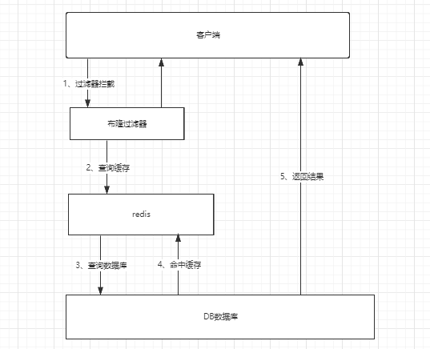
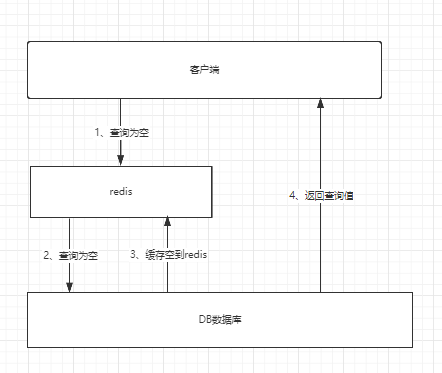

* content
{:toc}
# 缓存穿透与雪崩

## 缓存穿透

### 概念

> 在默认情况下，用户请求数据时，会先在缓存（Redis）中查找，若没找到即缓存为命中，再在数据库中查找，数量少可能问题不大，可是一旦大量的请求数据（例如秒杀场景），缓存没有命中的话，就会将请求全部转移到数据库上，造成数据库的压力剧增，就有可能导致数据库的崩溃。
>
> 网络安全中的也有人恶意使用这种手段进行攻击称为洪水攻击

### 解决方案

#### 布隆过滤器：

对所有可能查询的参数以hash的形式存储，以便快速确定是否存在这个值，在控制层先进行拦截，检验不通过则直接打回，减轻了存储系统的压力

#### 缓存空对象（查询不到）

一次查询若在缓存与数据库中都没有查询到，就在缓存中放一个空对象用于处理后续这个请求

这样做有一个缺陷：储存空对象也需要空间，大量空对象会消耗一定的空间，储存效率并不高。解决这个缺陷的方式就是 **设置较短的过期时间**。即使对空置设置了过期时间，还是会存在缓存层和储存层的数据会有一段时间的不一致，这对于需要保持一致性的业务会有影响。

## 缓存击穿（量太大，缓存过期）

### 概念

> 相较于缓存穿透，缓存击穿的目的性更强，一个存在key，在缓存过期的一刻，同时有大量的请求，这些请求都会击穿到 DB ，造成瞬时的 DB 请求量大、压力骤增。这就是缓存被击穿，只是针对其中某个 key 的缓存不可用而导致的击穿，但是其他的 key 仍然可以使用缓存响应。

比如热搜排行榜，一个热点新闻同时被大量访问就可能导致缓存击穿。

### 解决方案

#### 设置热点数据永不过期

这样就不会出现热点数据过期的情况，但是当Redis内存空间满的时候，也会清理部分书，而且此种方案会暂占用空间，一旦热点数据多了起来，久会占用大量空间

#### 加互斥锁（分布式锁）

在访问 key 之前，采用 setnx （set  if  not exists）来设置另一个短期 key 来锁住当前 key 的访问，访问结束再删除改短期key。保证同时刻只有一个线程访问。这样对锁的要求就十分高。

## 缓存雪崩

### 概念

大量的 key 设置了相同的过期时间，导致在缓存在同一时刻的 key 全部消失，造成瞬时 DB 请求量大、压力骤增、引起雪崩。

### 解决方案

#### redis高可用

这个思想的含义是：既然redis有可能挂掉，那就多增加几台 redis , 这样一台挂掉之后其他还可以继续工作，其实就是**搭建集群**

#### 限流降级

在缓存失效后，通过加锁或者队列来控制读数据库写幻想村的线程数量。比如对某个key只允许一个线程查询数据和写缓存，其他线程等待

#### 数据预热

数据预热的含义就是在正式部署之前，我先把可能的 数据先预先访问一遍，这样部门可能大量访问的数据久会加载到内存中。在即将发生大并发访问前手动触发加载缓存不同的key，设置不同的过期时间，让缓存失效的时间点尽量均匀。

