* content
{:toc}
# Redis配置

## 内存设置

> 容量单位不区分大小写，G和GB有区别

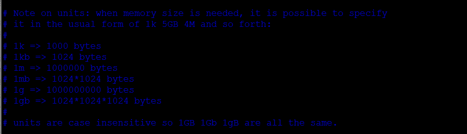

## 其他配置文件设置

> 可以设置多个配置文件组合使用

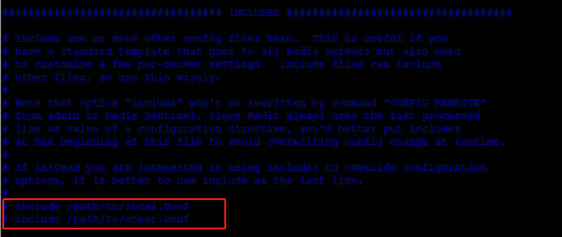

## 网络设置

>bind 127.0.0.1  # IP绑定
>
>protected-mode yes	# 保护模式，默认开启
>
>port 6379	# 端口号，默认6379

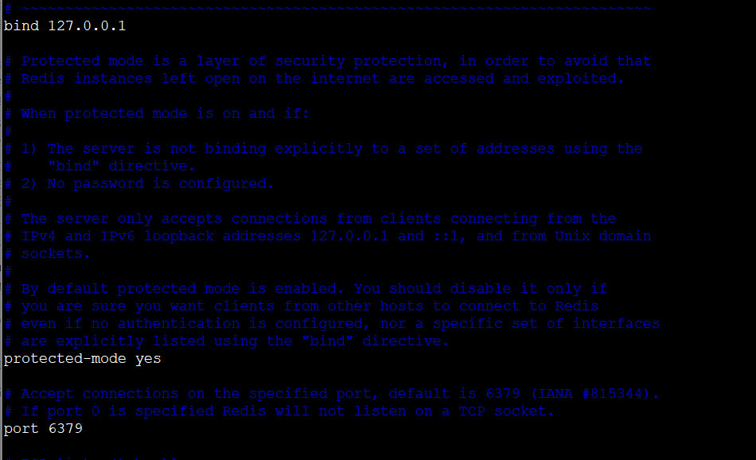


## 日志输出级别

> loglevel notice	# 日志级别设置。（有debug,verbose,notice,waring四种级别）
>
> logfile	"" # 日志文件名称


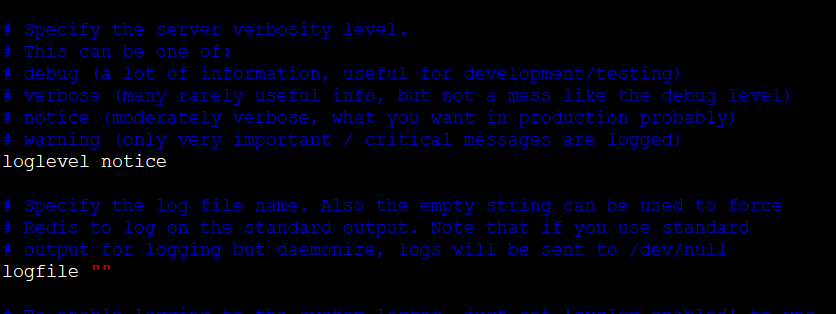


## 持久化（RDB，SNAPSHOTTING）

>- 持久化规则，持久化文件 .rdb  .aof文件中
>
>save 900 1 # 如果900秒内， 至少1个key进行了修改，就进行持久化
>
>save 300 10	# 300 秒内， 10个 key 进行了修改，则进行持久化
>
>save 60 10000	# 60秒内， 10000个 key  进行了修改，则进行持久化

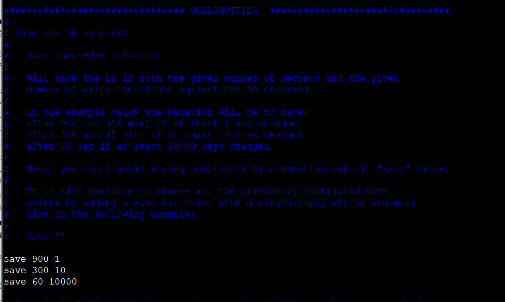


>  stop-writes-on-bgsave-error yes	# 持久化错误继续工作
>
>  rdbcompression yes	# 压缩 .rdb 文件
>
> rdbchecksum yes	# 检验 rdb文件
>
> dbfilename dump.rdb	# 保存文件名称为 dump.rdb
>
> dir ./	# rdb 文件保存的目录


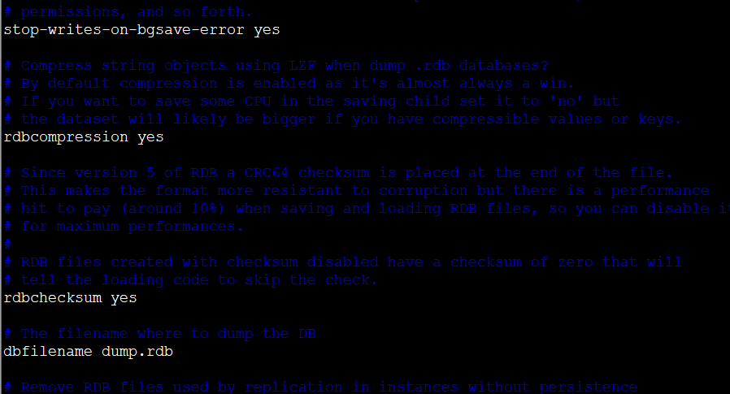

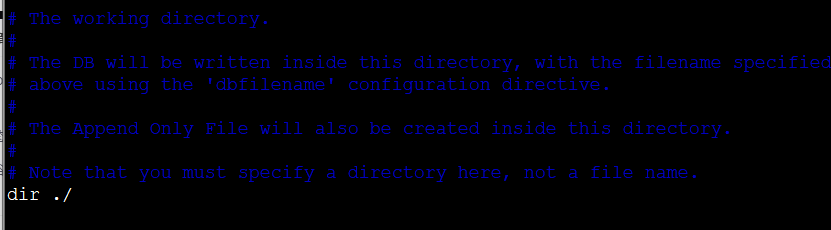


## 主从复制

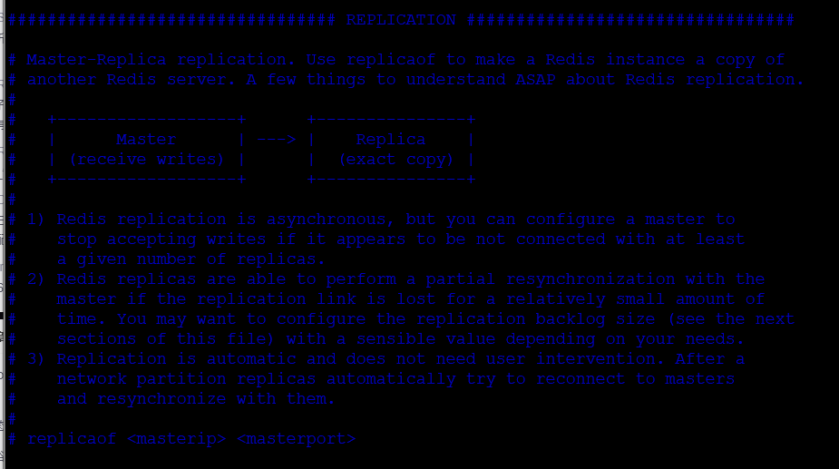


## 密码设置

> requirepass foobared # 密码设置

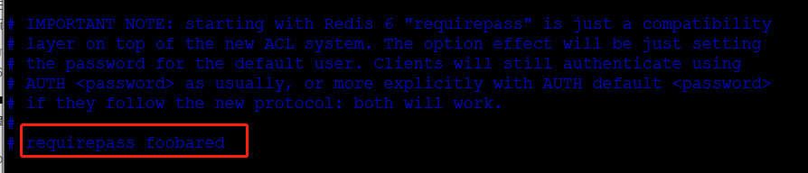


## 客户端连接设置

> maxclients 10000  最大客户端数量
> maxmemory <bytes> 最大内存限制
> maxmemory-policy noeviction 

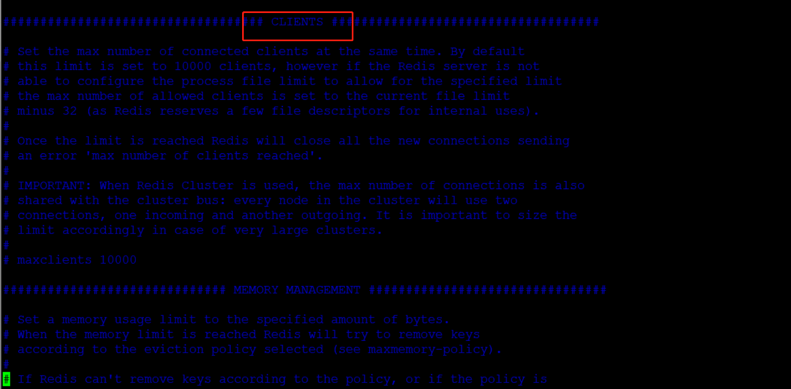


## 过期策略配置

> 有八种过期策略配置
>
> ```conf
> # 只对设置了过期时间的key进行lru
> volatile-lru -> Evict using approximated LRU, only keys with an expire set.
> # 删除lru算法的key
> allkeys-lru -> Evict any key using approximated LRU.
> # 只对设置了过期时间的key进行lfu
> volatile-lfu -> Evict using approximated LFU, only keys with an expire set.
> # 删除lfu算法的key
> allkeys-lfu -> Evict any key using approximated LFU.	
> # 随机删除即将过期key
> volatile-random -> Remove a random key having an expire set.
> # 随机删除
> allkeys-random -> Remove a random key, any key.
> # 删除即将过期的
> volatile-ttl -> Remove the key with the nearest expire time (minor TTL)
> # 永不过期，返回错误
> noeviction -> Don't evict anything, just return an error on write operations
> ```
>
> 默认过期策略是：noeviction

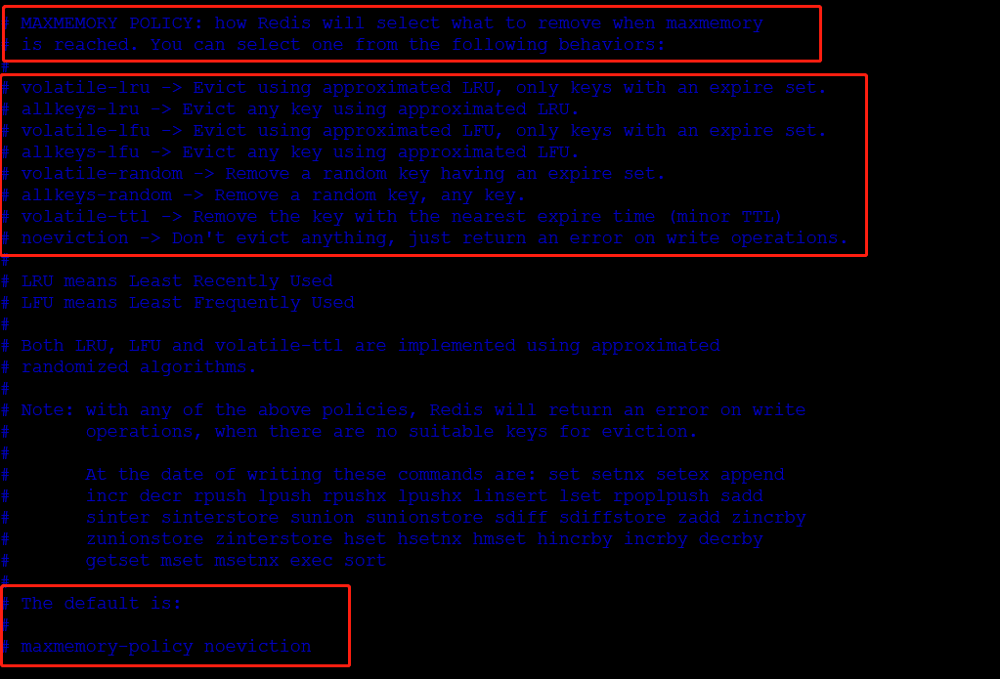


## 持久化（AOF）

>```conf
>
>appendonly no	# 默认不开启 AOF 
>appendfilename "appendonly.aof"	# 默认文件名
>
>appendfsync always	# 每次修改进行同步
>appendfsync everysec	# 每秒执行一次同步
>appendfsync no	# 不进行同步， 由操作系统进行同步，速度最快
>```
>
>
>
>

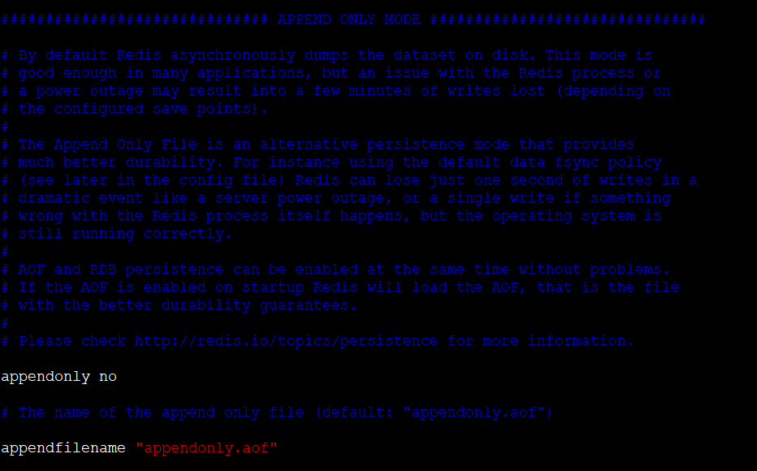

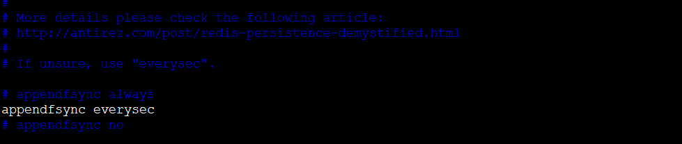